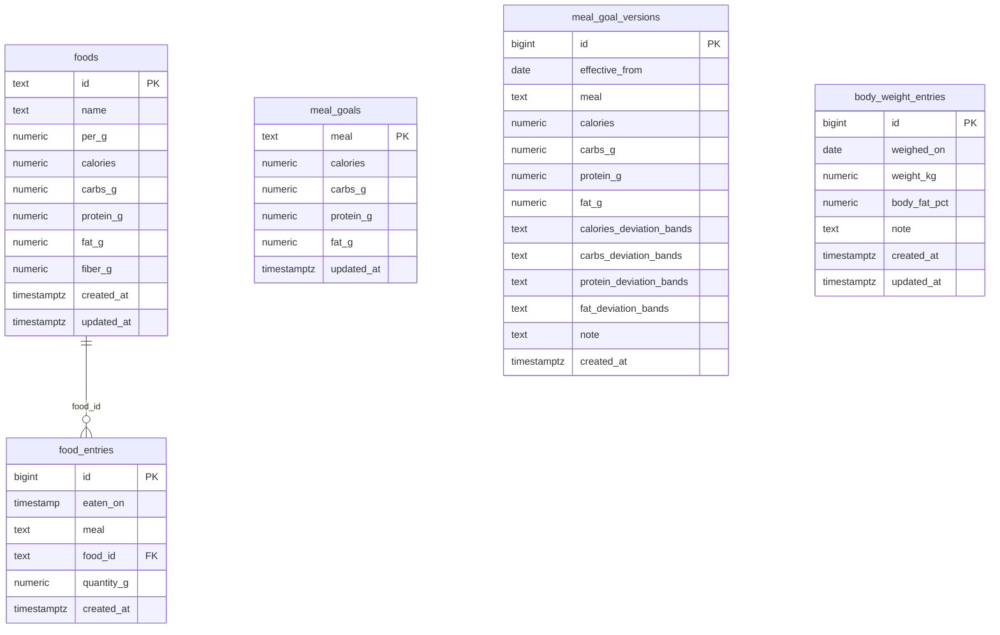

# calcunt database schema

This document describes the deployed PostgreSQL schema in the Supabase project
`calcunt` (project reference `lncciiekrzsvfjjuumbu`). The application uses the
`public` schema and exposes its tables through the Supabase Data REST API.

## Data model



## `public.foods`

One row per distinct food. Nutrition values are stored relative to `per_g`,
which is normally 100 grams. A food is reused by any number of log entries.

| Column | Type | Rules | Meaning |
| --- | --- | --- | --- |
| `id` | `text` | Primary key; snake-case slug | Stable food identifier, such as `rice_white_cooked` |
| `name` | `text` | Required; non-empty | Display name |
| `per_g` | `numeric` | Required; `> 0`; default `100` | Gram basis for the nutrition values |
| `calories` | `numeric` | Required; `>= 0` | Kilocalories per `per_g` grams |
| `carbs_g` | `numeric` | Required; `>= 0` | Carbohydrates per `per_g` grams |
| `protein_g` | `numeric` | Required; `>= 0` | Protein per `per_g` grams |
| `fat_g` | `numeric` | Required; `>= 0` | Fat per `per_g` grams |
| `fiber_g` | `numeric` | Required; `>= 0` | Fiber per `per_g` grams |
| `created_at` | `timestamptz` | Required; default `now()` | Creation timestamp |
| `updated_at` | `timestamptz` | Required; default `now()` | Last-update timestamp; callers must update it explicitly |

The `id` constraint accepts lowercase letters, digits, and single underscore-
separated segments. It rejects spaces, uppercase letters, and leading,
trailing, or repeated underscores.

## `public.food_entries`

One row per food item eaten. A meal containing rice and chicken is represented
by two rows. Nutrition totals are intentionally not stored here: the frontend
derives them from `quantity_g` and the referenced `foods` row.

| Column | Type | Rules | Meaning |
| --- | --- | --- | --- |
| `id` | `bigint` | Primary key; generated identity | Entry identifier |
| `eaten_on` | `timestamp without time zone` | Required | Eating date and wall-clock time |
| `meal` | `text` | Required; allowed values below | Meal category |
| `food_id` | `text` | Required; foreign key to `foods.id` | Food eaten |
| `quantity_g` | `numeric` | Required; `> 0` | Quantity eaten in grams |
| `created_at` | `timestamptz` | Required; default `now()` | Creation timestamp |

Allowed `meal` values are:

- `breakfast`
- `lunch`
- `dinner`
- `snack`

The foreign key uses `ON UPDATE CASCADE` and `ON DELETE RESTRICT`. Renaming a
food ID updates its entries; deleting a food referenced by an entry is blocked.

`eaten_on` is a timezone-free calendar timestamp. It records the day and clock
time of eating exactly as entered, without geographic timezone conversion. The
40 rows migrated from GitHub originally contained dates only, so they use these
meal-specific defaults:

| Meal | Default wall-clock time |
| --- | --- |
| `breakfast` | `09:00` |
| `lunch` | `14:00` |
| `dinner` | `20:00` |
| `snack` | `23:00` |

Future entries must also contain a time. When the user does not supply one,
the same meal-specific defaults are used and disclosed in the confirmation.

## `public.meal_goal_versions`

One row per meal goal version. This is the source of truth for goal-based
visualizations. A food entry is evaluated against the most recent goal row for
the same meal whose `effective_from` date is less than or equal to the entry's
calendar date.

This means changing the current goal does not rewrite history: old food entries
continue to be evaluated against the goal that was active on their own date.

| Column | Type | Rules | Meaning |
| --- | --- | --- | --- |
| `id` | `bigint` | Primary key; generated identity | Goal version identifier |
| `effective_from` | `date` | Required; unique with `meal` | First calendar date when this goal applies |
| `meal` | `text` | Required; same four allowed values | Meal category |
| `calories` | `numeric` | Required; `>= 0` | Calorie target |
| `carbs_g` | `numeric` | Required; `>= 0` | Carbohydrate target in grams |
| `protein_g` | `numeric` | Required; `>= 0` | Protein target in grams |
| `fat_g` | `numeric` | Required; `>= 0` | Fat target in grams |
| `calories_deviation_bands` | `text` | Required; default `10,20,30`; three ascending numeric thresholds | Calorie deviation cutoffs for `good`, `ok`, and `bad`; values above the third cutoff are `terrible` |
| `carbs_deviation_bands` | `text` | Required; default `10,20,30`; same format | Carbohydrate deviation cutoffs |
| `protein_deviation_bands` | `text` | Required; default `10,20,30`; same format | Protein deviation cutoffs |
| `fat_deviation_bands` | `text` | Required; default `10,20,30`; same format | Fat deviation cutoffs |
| `note` | `text` | Optional | Short reason or plan label |
| `created_at` | `timestamptz` | Required; default `now()` | Creation timestamp |

There is no fiber goal because fiber is displayed but is not part of the
goal-based visualizations. A band value like `10,20,30` means:
`good <= 10%`, `ok <= 20%`, `bad <= 30%`, and `terrible > 30%` outside the
goal. The four band columns allow each macro to use different tolerance
thresholds.

Suggested setup SQL:

```sql
create table public.meal_goal_versions (
  id bigint generated always as identity primary key,
  effective_from date not null,
  meal text not null check (meal in ('breakfast', 'lunch', 'dinner', 'snack')),
  calories numeric not null check (calories >= 0),
  carbs_g numeric not null check (carbs_g >= 0),
  protein_g numeric not null check (protein_g >= 0),
  fat_g numeric not null check (fat_g >= 0),
  calories_deviation_bands text not null default '10,20,30'
    check (calories_deviation_bands ~ '^\s*([0-9]+(?:\.[0-9]+)?\s*,\s*){2}[0-9]+(?:\.[0-9]+)?\s*$'),
  carbs_deviation_bands text not null default '10,20,30'
    check (carbs_deviation_bands ~ '^\s*([0-9]+(?:\.[0-9]+)?\s*,\s*){2}[0-9]+(?:\.[0-9]+)?\s*$'),
  protein_deviation_bands text not null default '10,20,30'
    check (protein_deviation_bands ~ '^\s*([0-9]+(?:\.[0-9]+)?\s*,\s*){2}[0-9]+(?:\.[0-9]+)?\s*$'),
  fat_deviation_bands text not null default '10,20,30'
    check (fat_deviation_bands ~ '^\s*([0-9]+(?:\.[0-9]+)?\s*,\s*){2}[0-9]+(?:\.[0-9]+)?\s*$'),
  note text,
  created_at timestamptz not null default now(),
  unique (effective_from, meal)
);

alter table public.meal_goal_versions enable row level security;

create policy "public read meal goal versions"
  on public.meal_goal_versions
  for select
  to anon, authenticated
  using (true);

grant select on public.meal_goal_versions to anon, authenticated;
grant select, insert, update, delete on public.meal_goal_versions to service_role;
grant usage, select on sequence public.meal_goal_versions_id_seq to service_role;
```

When migrating an existing deployment, seed the version table from the current
legacy goals. Use `0001-01-01` for the initial goal when it should apply to
all older food history.

```sql
insert into public.meal_goal_versions
  (effective_from, meal, calories, carbs_g, protein_g, fat_g,
   calories_deviation_bands, carbs_deviation_bands,
   protein_deviation_bands, fat_deviation_bands, note)
select
  date '0001-01-01' as effective_from,
  meal,
  calories,
  carbs_g,
  protein_g,
  fat_g,
  '10,20,30',
  '10,20,30',
  '10,20,30',
  '10,20,30',
  'initial goal, valid from beginning of history'
from public.meal_goals
on conflict (effective_from, meal) do update
set calories = excluded.calories,
    carbs_g = excluded.carbs_g,
    protein_g = excluded.protein_g,
    fat_g = excluded.fat_g,
    calories_deviation_bands = excluded.calories_deviation_bands,
    carbs_deviation_bands = excluded.carbs_deviation_bands,
    protein_deviation_bands = excluded.protein_deviation_bands,
    fat_deviation_bands = excluded.fat_deviation_bands,
    note = excluded.note;
```

## `public.meal_goals`

Legacy compatibility table with exactly one current goal row per meal category.
The frontend uses this only when `meal_goal_versions` does not exist or has no
rows. New goal changes should be written to `meal_goal_versions`.

| Column | Type | Rules | Meaning |
| --- | --- | --- | --- |
| `meal` | `text` | Primary key; same four allowed values | Meal category |
| `calories` | `numeric` | Required; `>= 0` | Calorie target |
| `carbs_g` | `numeric` | Required; `>= 0` | Carbohydrate target in grams |
| `protein_g` | `numeric` | Required; `>= 0` | Protein target in grams |
| `fat_g` | `numeric` | Required; `>= 0` | Fat target in grams |
| `updated_at` | `timestamptz` | Required; default `now()` | Last-update timestamp; callers must update it explicitly |

There is no fiber goal because fiber is displayed but is not part of the
goal-based visualizations.

## `public.body_weight_entries`

One row per body-weight measurement. Weight is independent from meals and foods,
so it is stored in its own date-based table.

| Column | Type | Rules | Meaning |
| --- | --- | --- | --- |
| `id` | `bigint` | Primary key; generated identity | Weight entry identifier |
| `weighed_on` | `date` | Required; unique | Calendar date of the measurement |
| `weight_kg` | `numeric` | Required; `> 0` | Body weight in kilograms |
| `body_fat_pct` | `numeric` | Optional; `>= 0` and `< 100` | Body-fat percentage measured on the same date |
| `note` | `text` | Optional | Short context, such as morning/evening |
| `created_at` | `timestamptz` | Required; default `now()` | Creation timestamp |
| `updated_at` | `timestamptz` | Required; default `now()` | Last-update timestamp; callers must update it explicitly |

Suggested setup SQL:

```sql
create table public.body_weight_entries (
  id bigint generated always as identity primary key,
  weighed_on date not null unique,
  weight_kg numeric not null check (weight_kg > 0),
  body_fat_pct numeric check (body_fat_pct is null or
                              (body_fat_pct >= 0 and body_fat_pct < 100)),
  note text,
  created_at timestamptz not null default now(),
  updated_at timestamptz not null default now()
);

create index body_weight_entries_weighed_on_idx
  on public.body_weight_entries (weighed_on desc);

alter table public.body_weight_entries enable row level security;

create policy "public read body weight entries"
  on public.body_weight_entries
  for select
  to anon, authenticated
  using (true);

grant select on public.body_weight_entries to anon, authenticated;
```

## Derived nutrition

For each entry and nutrient, the application computes:

```text
entry_value = food_value * food_entries.quantity_g / foods.per_g
```

For example, 150 g of a food containing 130 kcal per 100 g contributes
`130 * 150 / 100 = 195 kcal`. Keeping derived values out of `food_entries`
means correcting a food label automatically corrects all historical totals.

## Indexes

| Index | Definition and purpose |
| --- | --- |
| `foods_pkey` | Unique B-tree index on `foods(id)` |
| `food_entries_pkey` | Unique B-tree index on `food_entries(id)` |
| `food_entries_eaten_on_meal_idx` | B-tree on `(eaten_on DESC, meal, id)` for chronological application reads |
| `food_entries_food_id_idx` | B-tree on `(food_id)` for joins and foreign-key maintenance |
| `meal_goals_pkey` | Unique B-tree index on `meal_goals(meal)` |
| `meal_goal_versions_pkey` | Unique B-tree index on `meal_goal_versions(id)` |
| `meal_goal_versions_effective_from_meal_key` | Unique B-tree index on `(effective_from, meal)` to prevent two versions for the same meal on the same date |
| `body_weight_entries_pkey` | Unique B-tree index on `body_weight_entries(id)` |
| `body_weight_entries_weighed_on_key` | Unique B-tree index on `body_weight_entries(weighed_on)` |
| `body_weight_entries_weighed_on_idx` | B-tree on `(weighed_on DESC)` for chronological application reads |

## Data API and row-level security

Row-level security is enabled on all tables. Each table has one policy
allowing `SELECT` to the `anon` and `authenticated` roles with `USING (true)`:

| Table | Policy |
| --- | --- |
| `foods` | `public read foods` |
| `food_entries` | `public read food entries` |
| `meal_goals` | `public read meal goals` |
| `meal_goal_versions` | `public read meal goal versions` |
| `body_weight_entries` | `public read body weight entries` |

There are no RLS policies for `INSERT`, `UPDATE`, or `DELETE`. Consequently,
requests using the public publishable key can read all rows but cannot change
them. Administrative connections that bypass RLS, including the connected
Supabase management workflow used from ChatGPT, can add or update data.

The frontend requires explicit `SELECT` grants to `anon` and `authenticated`
for every table it reads. RLS is still the effective row-access boundary and
must remain enabled. There are no public write policies.

Never place a Supabase secret key or legacy `service_role` key in the website.
The frontend should use only the publishable key.

## Writing a meal entry

1. Resolve the food to an existing `foods.id`.
2. If it is new, insert its nutrition values into `foods`, normalized to a
   100 g basis.
3. Insert one `food_entries` row per food item, using the eating date and time,
   meal category, food ID, and quantity in grams.
4. Do not calculate or store entry calories or macronutrients.

Example administrative transaction:

```sql
begin;

insert into public.foods
  (id, name, per_g, calories, carbs_g, protein_g, fat_g, fiber_g)
values
  ('rice_white_cooked', 'White rice, cooked', 100, 130, 28.2, 2.7, 0.3, 0.4)
on conflict (id) do nothing;

insert into public.food_entries (eaten_on, meal, food_id, quantity_g)
values ('2026-08-10 14:00:00',
        'lunch', 'rice_white_cooked', 150);

commit;
```

## Current deployed contents

At the time this document was generated, the database contained:

- 64 foods
- 92 food entries
- 4 meal goals
- 8 meal goal versions
- 1 body weight entry
- 0 food entries with a missing food reference

## References

- [Supabase Row Level Security](https://supabase.com/docs/guides/database/postgres/row-level-security)
- [Securing the Supabase Data API](https://supabase.com/docs/guides/api/securing-your-api)
- [Supabase API keys](https://supabase.com/docs/guides/api/api-keys)
